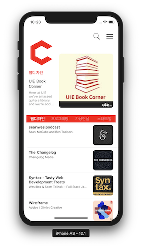
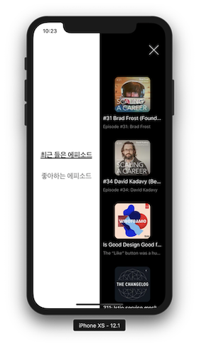

## DaumPodcast App
> 부스트캠프 3기 iOS과정 D2팀

### 팀원소개 및 역할
- [김가온](https://github.com/gaonK)
    - 스플래시 애니메이션
    - 메인뷰
    - 페이지네이션 
- [오재현](https://github.com/oingbong)
    - 심볼 애니메이션
    - 헤더뷰
    - SQLite
- [이병탁](https://github.com/tak8997)
    - 메인 뷰 - 탭바 애니메이션(+ 메인 좌우 스크롤 전체적인 틀)
    - 검색 뷰, 팟캐스트 뷰, 오디오모달 뷰, 오디오 미니플레이어 뷰
    - Transition 애니메이션

### 기획의도
 - 애니메이션과 인터렉션에 차별화 된 앱을 만들어보자
 
 ### 앱소개
 - 다음 웹툰의 UI / UX를 적용한 Podcast 앱
 
### 사용기술
 - Core Animation
 - UrlSession & GCD
 - SQLite
 
 ### 전체 데모영상

### 페이지

### 심볼 데모영상

